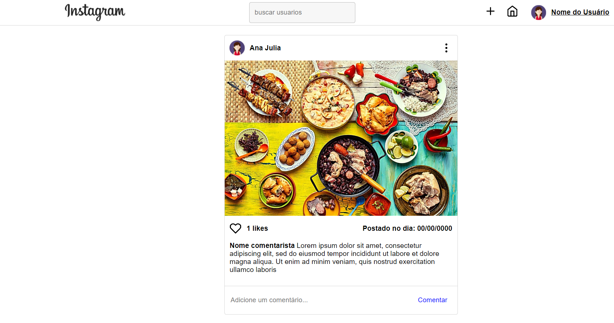
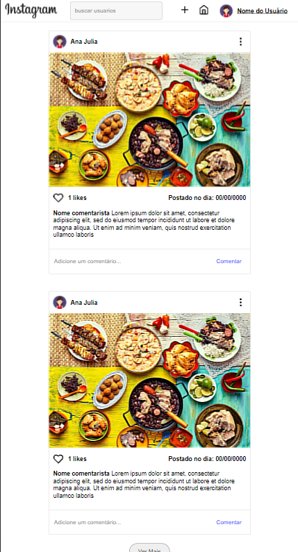

# Manipulando-elementos-DOM-JavaScript
O objetivo desse projeto é praticar javaScript, mais precisamente a respeito do DOM e a sua influencia quando utilizado para modificar a view.

## Sobre o projeto
O projeto consiste em uma página simples similar ao instagram, onde ao clicar em ver mais, um novo post é gerado átraves do DOM

## Conteúdo
- View dinâmica

## Como rodar o projeto
Basta possuir o Vs Code, Live Server e nodeJS. 

## Telas do projeto

## Telas do home

## Telas do homeModificadaPorDOM

